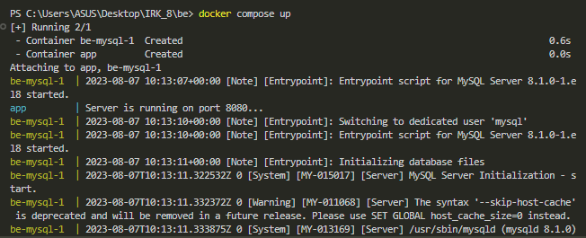

# Course Selector - Memaksimalkan IP dengan Dynamic Programming
## Deskripsi Program
Course Selector adalah sebuah program yang menggunakan teknik dynamic programming untuk membantu mahasiswa dalam memilih mata kuliah yang akan diambil di semester ini dengan tujuan memaksimalkan Indeks Prestasi (IP) mereka. Program ini akan memberikan rekomendasi kombinasi mata kuliah yang memungkinkan mahasiswa mendapatkan IP terbaik, sambil juga mempertimbangkan Beban SKS (Satuan Kredit Semester) yang dapat diambil sebanyak mungkin. Mata kuliah yang dipilih harus memenuhi syarat minimum semesternya dan diajarkan di fakultas yang sama.

Sebagai contoh, seorang mahasiswa dari program studi Teknik Informatika dapat mengambil mata kuliah yang diajarkan di fakultas yang relevan seperti Teknik Elektro, STEI, dan lainnya.

## Teknologi dan Framework
Program ini dibangun dengan menggunakan teknologi dan framework berikut:

Backend: Bahasa pemrograman GO digunakan sebagai bahasa utama untuk mengembangkan bagian backend dari aplikasi. Database MySQL digunakan untuk menyimpan informasi mengenai mata kuliah, syarat minimum, dan informasi lain yang diperlukan.

Frontend: Antarmuka pengguna dibangun menggunakan framework React, yang memberikan pengalaman pengguna yang interaktif dan responsif.

## Backend: Penjelasan Dynamic Programming
Dynamic programming adalah teknik pemecahan masalah yang sering digunakan dalam ilmu komputer dan matematika untuk menyelesaikan masalah optimasi dan komputasi berulang dengan cara membagi masalah menjadi submasalah yang lebih kecil dan menyimpan solusi submasalah tersebut agar dapat digunakan kembali. Teknik ini biasanya digunakan ketika kita memiliki masalah yang dapat dipecahkan dalam beberapa langkah yang lebih sederhana, dan setiap langkah memiliki solusi yang dapat digunakan untuk memecahkan masalah yang lebih besar.

Dalam konteks Course Selector, dynamic programming digunakan untuk mengoptimalkan pemilihan mata kuliah dengan mempertimbangkan berbagai faktor seperti IP, Beban SKS, dan syarat minimum mata kuliah.

## Backend: Penjelasan Algoritma
Program Course Selector menggunakan algoritma 0-1 knapsack untuk mengatasi masalah pemilihan mata kuliah. Algoritma ini bekerja dengan prinsip memilih atau tidak memilih suatu item (mata kuliah) untuk dimasukkan ke dalam "knapsack" (semua mata kuliah yang dapat diambil dalam satu semester) dengan bobot maksimum tertentu (jumlah maksimum SKS yang dapat diambil).

## Langkah-langkah algoritma:
Backend: Penjelasan Algoritma
Program Course Selector menggunakan algoritma 0-1 knapsack untuk mengatasi masalah pemilihan mata kuliah. Algoritma ini bekerja dengan prinsip memilih atau tidak memilih suatu item (mata kuliah) untuk dimasukkan ke dalam "knapsack" (semua mata kuliah yang dapat diambil dalam satu semester) dengan bobotnya TEPAT SAMA dengan bobot W.

Langkah-langkah algoritma:
1. Melakukan seleksi mata kuliah valid yang syaratnya (semester sekarang >= min semester dan memiliki hubungan fakultas/jurusan)
2. Membuat tabel DP (Dynamic Programming) dengan ukuran (jumlah mata kuliah valid + 1) x (jumlah maksimum SKS + 1). Inisialisasi tabel dengan 0, dan pada kasus dp[0][w] = -tak hingga.
3. Melakukan iterasi untuk setiap mata kuliah dan bobot SKS mulai dari 0.
4. Pada setiap langkah iterasi, program akan membandingkan dua pilihan: mengambil mata kuliah tersebut atau tidak mengambilnya. Matkul akan diambil jika bobot weighted (nilai*SKS) nya lebih baik daripada tidak mengambil. 
5. Program akan memasukkan nilai tertinggi dari kedua pilihan (mengambil atau tidak mengambil) ke dalam tabel DP.
6. Setelah selesai melakukan iterasi dari range matkul terendah sampai tertinggi pada tabel akhir DP. Program akan mendapatkan kombinasi mata kuliah terbaik dengan IP tertinggi dan Beban SKS yang sesuai.

## Cara menjalankan aplikasi (docker-compose up -d)
docker-compose up -d

## Referensi Belajar
1. Youtube, Programmer Zaman Now, Golang, Youtube
2. Youtube, Imre Nagi, Docker